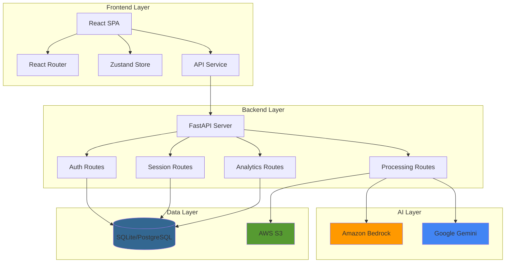

# Design Document: LexiLearn Platform

## Overview

LexiLearn is a full-stack dyslexia-first learning platform built with modern web technologies and AI integration. The system follows a three-tier architecture with a React frontend, FastAPI backend, and dual AI provider integration (Amazon Bedrock + Google Gemini).

The platform implements role-based access control (RBAC) with four distinct user types, each with tailored interfaces and functionality. The system tracks reading sessions in real-time, calculates performance metrics, and provides actionable insights through comprehensive analytics.

**Technology Stack:**
- **Frontend**: React 19, Vite, Tailwind CSS 4, Zustand, React Router 7, Recharts
- **Backend**: FastAPI (Python 3.12), SQLAlchemy ORM, Pydantic
- **Database**: SQLite (development), PostgreSQL-compatible (production)
- **AI**: Amazon Bedrock (Claude 3 Sonnet), Google Gemini 1.5 Flash
- **Authentication**: JWT with OAuth2 password flow, bcrypt password hashing
- **Cloud**: AWS S3 (file storage), AWS Bedrock (AI inference)
- **Deployment**: Docker, AWS-ready

## Architecture

### System Architecture Diagram



### Request Flow

1. **Authentication Flow**:
   - User submits credentials → Frontend API Service
   - API Service sends OAuth2 form data → Backend /api/auth/login
   - Backend validates credentials, generates JWT
   - JWT stored in localStorage, user data in Zustand store
   - Subsequent requests include JWT in Authorization header

2. **AI Processing Flow**:
   - User requests text simplification → Frontend
   - Frontend sends authenticated request → Backend /api/processing/simplify
   - Backend attempts Bedrock invocation
   - If Bedrock fails, fallback to Gemini
   - AI response returned to frontend

3. **Analytics Flow**:
   - Student completes reading session → Frontend tracks metrics
   - Frontend sends metrics array → Backend /api/analytics/sessions/{id}/calculate
   - Backend calculates fatigue score, averages
   - Backend updates session record
   - Backend returns comprehensive analytics

## Components and Interfaces

### Backend Components

#### 1. Core Configuration (`app/core/`)

**config.py**:
```python
class Settings(BaseSettings):
    PROJECT_NAME: str
    API_VERSION: str
    ENVIRONMENT: str
    SECRET_KEY: str
    ACCESS_TOKEN_EXPIRE_MINUTES: int
    DATABASE_URL: str
    GEMINI_API_KEY: Optional[str]
    AWS_ACCESS_KEY_ID: Optional[str]
    AWS_SECRET_ACCESS_KEY: Optional[str]
    AWS_REGION: str
    BEDROCK_MODEL_ID: str
    S3_BUCKET_NAME: str
    BACKEND_CORS_ORIGINS: List[str]
```

**security.py**:
```python
def create_access_token(subject: Union[str, Any], expires_delta: Optional[timedelta]) -> str
def verify_password(plain_password: str, hashed_password: str) -> bool
def get_password_hash(password: str) -> str
```

**database.py**:
```python
engine = create_engine(DATABASE_URL)
SessionLocal = sessionmaker(bind=engine)
Base = declarative_base()

def get_db() -> Generator:
    # Yields database session
```

#### 2. Database Models (`app/models/database.py`)

**User Model**:
```python
class User(Base):
    id: Integer (PK)
    email: String (unique, indexed)
    hashed_password: String
    full_name: String
    role: String (enum: student, teacher, parent, admin)
    is_active: Boolean
    created_at: DateTime
    updated_at: DateTime
    
    # Relationships
    student_profile: StudentProfile
    teacher_profile: TeacherProfile
    parent_profile: ParentProfile
```

**StudentProfile Model**:
```python
class StudentProfile(Base):
    id: Integer (PK)
    user_id: Integer (FK → users.id)
    grade_level: String
    reading_level: String
    learning_disability_type: String
    teacher_id: Integer (FK → teacher_profiles.id)
    parent_id: Integer (FK → parent_profiles.id)
    
    # Relationships
    user: User
    sessions: List[LearningSession]
    quiz_results: List[QuizResult]
```

**LearningSession Model**:
```python
class LearningSession(Base):
    id: Integer (PK)
    student_id: Integer (FK → student_profiles.id)
    start_time: DateTime
    end_time: DateTime (nullable)
    content_id: String
    content_type: String
    reading_speed: Float (nullable)
    accuracy_score: Float (nullable)
    fatigue_score: Float (nullable)
    words_per_minute: Float (nullable)
    metrics_log: JSON (nullable)
    
    # Relationships
    student: StudentProfile
```

#### 3. API Routes

**Authentication Routes** (`/api/auth`):
- `POST /login` - OAuth2 token login
- `POST /register` - User registration with profile creation
- `GET /me` - Get current authenticated user

**Processing Routes** (`/api/processing`):
- `POST /simplify` - Text simplification with grade level
- `POST /quiz/generate` - AI quiz generation
- `POST /rag/query` - RAG-based question answering
- `POST /upload` - PDF upload and text extraction
- `POST /concepts` - Concept and vocabulary extraction

**Session Routes** (`/api/sessions`):
- `POST /` - Create new learning session
- `PUT /{session_id}` - Update session metrics
- `GET /me` - Get user's sessions (paginated)

**Analytics Routes** (`/api/analytics`):
- `POST /sessions/{session_id}/calculate` - Calculate session analytics
- `GET /student/{student_id}/summary` - Student performance summary
- `GET /class/{class_id}/stats` - Class-level statistics

**Quiz Routes** (`/api/quizzes`):
- `POST /results` - Submit quiz result

#### 4. AI Service (`app/services/ai.py`)

**AIService Class**:
```python
class AIService:
    def __init__(self):
        # Initialize Bedrock and Gemini clients
        
    async def _invoke_bedrock(self, prompt: str, system_prompt: Optional[str]) -> str:
        # Invoke Amazon Bedrock (Claude 3)
        
    async def simplify_text(self, text: str, level: int) -> str:
        # Try Bedrock, fallback to Gemini
        
    async def generate_quiz(self, text: str, num_questions: int) -> List[Dict]:
        # Generate quiz with Bedrock/Gemini
        # Parse JSON from response
        
    async def rag_query(self, query: str, context: str) -> str:
        # RAG workflow with Bedrock/Gemini
```

**AI Provider Strategy**:
1. Primary: Amazon Bedrock (Claude 3 Sonnet)
   - Model ID: `anthropic.claude-3-sonnet-20240229-v1:0`
   - Max tokens: 4096
   - System prompts for dyslexia-friendly output
2. Fallback: Google Gemini 1.5 Flash
   - Used when Bedrock unavailable
   - Same prompt structure

#### 5. Analytics Service (`app/services/analytics.py`)

**Key Functions**:
```python
def calculate_fatigue_score(metrics: List[ReadingMetric]) -> float:
    # Analyze reading speed decline, pause frequency
    # Return 0-1 score
    
def suggest_reading_level(current_level: int, accuracy: float) -> int:
    # Recommend next level based on performance
    
def identify_at_risk_factors(student_data: Dict) -> List[str]:
    # Identify specific risk factors
    # Return list of concern areas
    
def aggregate_class_stats(summaries: List[StudentPerformanceSummary]) -> Dict:
    # Aggregate class-level metrics
```

### Frontend Components

#### 1. State Management (Zustand)

**authStore.js**:
```javascript
{
  user: User | null,
  isAuthenticated: boolean,
  isLoading: boolean,
  error: string | null,
  
  login: async (role, email, password) => User,
  logout: () => void,
  register: async (role, data) => User,
  checkAuth: async () => void
}
```

**accessibilityStore.js**:
```javascript
{
  fontSize: number,
  highContrast: boolean,
  readingPace: number,
  audioEnabled: boolean,
  
  setFontSize: (size) => void,
  toggleHighContrast: () => void,
  setReadingPace: (pace) => void,
  toggleAudio: () => void
}
```

#### 2. Routing (`router/AppRouter.jsx`)

```javascript
Routes:
  / → LandingPage (public)
  /login → Login (public)
  /student → StudentDashboard (protected: student role)
  /teacher → TeacherDashboard (protected: teacher role)
  /parent → ParentDashboard (protected: parent role)
  /settings → Settings (protected: any authenticated)
```

**ProtectedRoute Component**:
- Checks authentication status
- Verifies user role matches allowed roles
- Redirects to login if unauthenticated
- Redirects to user's dashboard if wrong role

#### 3. API Service (`services/apiService.js`)

**Key Methods**:
```javascript
// Authentication
login(email, password) → {access_token, token_type, user}
register(userData) → User
getMe() → User

// Text Processing
simplifyText(text, level) → {original, simplified, level}
generateQuiz(text, numQuestions) → {questions: [...]}
ragQuery(query, context) → {answer: string}
uploadPDF(file) → {filename, text, s3_key}
extractConcepts(text) → {concepts: [...], vocabulary: [...]}

// Sessions
startSession(contentId, contentType) → LearningSession
updateSessionMetrics(sessionId, metrics) → LearningSession
calculateSessionAnalytics(sessionId, metrics) → ReadingSessionAnalytics

// Analytics
getStudentSummary(studentId) → StudentPerformanceSummary
getClassStats(classId, teacherId) → ClassStatistics

// Quizzes
submitQuizResult(resultData) → QuizResult
```

**Token Management**:
- Stores JWT in `localStorage` as `lexilearn_token`
- Stores user object in `localStorage` as `lexilearn_user`
- Includes token in Authorization header: `Bearer {token}`
- Handles token expiration and logout

#### 4. Dashboard Components

**StudentDashboard**:
- Tabs: Home, Read, Quiz, Vocabulary, Progress
- Home: Quick stats, action cards, recent texts, weekly chart
- Read: Text input, sentence navigation, AI explanation, TTS, RAG Q&A
- Quiz: AI-generated quizzes, progress tracking, results
- Vocabulary: Word list with mastery progress
- Progress: Reading level, accuracy trend, improvement metrics

**TeacherDashboard**:
- Tabs: Overview, Students, Assignments, Messages
- Overview: Class metrics, at-risk alerts, progress charts, assignment status
- Students: Searchable list, detailed profiles, performance charts
- Assignments: Create/manage assignments, track completion
- Messages: Parent communication interface

**ParentDashboard**:
- Child progress overview
- Reading metrics and trends
- Teacher messaging
- Areas needing support

## Data Models

### Pydantic Schemas

**Authentication Schemas**:
```python
class UserCreate(BaseModel):
    email: EmailStr
    password: str
    full_name: str
    role: UserRole

class UserSchema(BaseModel):
    id: int
    email: EmailStr
    full_name: str
    role: UserRole
    is_active: bool
    created_at: datetime
    updated_at: datetime

class Token(BaseModel):
    access_token: str
    token_type: str
    user: UserSchema
```

**Session Schemas**:
```python
class LearningSessionCreate(BaseModel):
    student_id: int
    content_id: str
    content_type: str

class LearningSessionUpdate(BaseModel):
    end_time: Optional[datetime]
    reading_speed: Optional[float]
    accuracy_score: Optional[float]
    fatigue_score: Optional[float]
    words_per_minute: Optional[float]
    metrics_log: Optional[List[Dict[str, Any]]]
```

**Analytics Schemas**:
```python
class ReadingMetric(BaseModel):
    timestamp: datetime
    reading_speed_wpm: float
    accuracy_percentage: float
    simplification_level_requested: int
    reread_count: int
    pauses_detected: int
    fatigue_score: float

class ReadingSessionAnalytics(BaseModel):
    session_id: str
    student_id: str
    text_id: str
    total_reading_time_seconds: int
    avg_reading_speed_wpm: float
    final_comprehension_score: float
    metrics_over_time: List[ReadingMetric]
    key_bottlenecks: List[str]
    suggested_level_for_next_session: int

class StudentPerformanceSummary(BaseModel):
    student_id: str
    overall_reading_level: str
    avg_accuracy: float
    total_words_read: int
    mastered_vocabulary_count: int
    weekly_improvement_percentage: float
    at_risk: bool
    risk_factors: List[str]
    strengths: List[str]

class ClassStatistics(BaseModel):
    class_id: str
    teacher_id: str
    student_count: int
    avg_reading_level: str
    avg_comprehension_score: float
    at_risk_count: int
    most_difficult_concepts: List[str]
    recent_activity_count: int
```

## Correctness Properties

*A property is a characteristic or behavior that should hold true across all valid executions of a system—essentially, a formal statement about what the system should do. Properties serve as the bridge between human-readable specifications and machine-verifiable correctness guarantees.*

### Property 1: Authentication Token Validity

*For any* valid user credentials, when a user logs in, the system should generate a JWT token that can be successfully verified and decoded to retrieve the user ID.

**Validates: Requirements 1.3, 1.4, 1.8**

### Property 2: Password Hashing Security

*For any* password string, the hashed version should never match the original password, and verifying the original password against the hash should always succeed.

**Validates: Requirements 1.1, 19.6**

### Property 3: Role-Based Access Control

*For any* protected endpoint with role requirements, when a user with an incorrect role attempts access, the system should deny the request and return an authorization error.

**Validates: Requirements 1.10, 14.2**

### Property 4: Profile Creation Consistency

*For any* new user registration with a specific role, the system should create exactly one corresponding profile (StudentProfile, TeacherProfile, or ParentProfile) linked to that user.

**Validates: Requirements 1.2, 2.1**

### Property 5: AI Provider Fallback

*For any* AI processing request (simplification, quiz generation, RAG), if the primary provider (Bedrock) fails, the system should attempt the fallback provider (Gemini) before returning an error.

**Validates: Requirements 3.2, 3.3, 4.2, 4.3, 5.2, 5.3**

### Property 6: Session Ownership Verification

*For any* learning session operation (update, analytics calculation), the system should verify that the session belongs to the authenticated user before allowing the operation.

**Validates: Requirements 7.7, 8.2**

### Property 7: Metrics Calculation Accuracy

*For any* list of reading metrics, the calculated average reading speed should equal the sum of all reading speeds divided by the count of metrics.

**Validates: Requirements 8.3, 8.4**

### Property 8: Fatigue Score Bounds

*For any* calculated fatigue score, the value should be between 0 and 1 inclusive.

**Validates: Requirements 8.5**

### Property 9: At-Risk Identification Consistency

*For any* student with average comprehension below 60% OR average fatigue above 0.4, the system should mark the student as at-risk.

**Validates: Requirements 10.3, 10.4**

### Property 10: PDF Upload Validation

*For any* file upload, if the file content type is not "application/pdf", the system should reject the upload and return an error before attempting text extraction.

**Validates: Requirements 6.1, 6.2**

### Property 11: JWT Expiration Enforcement

*For any* JWT token, if the current time exceeds the token's expiration time, the system should reject authentication attempts using that token.

**Validates: Requirements 1.3, 1.9**

### Property 12: Database Relationship Integrity

*For any* StudentProfile record, the user_id foreign key should reference an existing User record with role="student".

**Validates: Requirements 2.1, 20.8**

### Property 13: Session Metrics Persistence

*For any* learning session with metrics, when the session is updated with metrics_log, retrieving the session should return the same metrics_log data.

**Validates: Requirements 7.5, 7.6**

### Property 14: Class Statistics Aggregation

*For any* set of student summaries, the aggregated average comprehension should equal the sum of all student comprehension scores divided by the student count.

**Validates: Requirements 11.5**

### Property 15: Quiz JSON Parsing Robustness

*For any* AI-generated quiz response containing JSON wrapped in code blocks (```json or ```), the system should successfully extract and parse the JSON content.

**Validates: Requirements 4.5**

### Property 16: Protected Route Redirection

*For any* unauthenticated user attempting to access a protected route, the system should redirect to the login page without rendering the protected content.

**Validates: Requirements 14.1**

### Property 17: Accessibility Preference Persistence

*For any* accessibility setting change (font size, high contrast, reading pace, audio), the setting should persist across page reloads.

**Validates: Requirements 15.7**

### Property 18: S3 Upload Graceful Degradation

*For any* PDF upload, if S3 upload fails, the system should continue with text extraction and return the extracted text without failing the entire request.

**Validates: Requirements 6.7**

### Property 19: Email Uniqueness Enforcement

*For any* registration attempt with an email that already exists in the database, the system should reject the registration and return an error.

**Validates: Requirements 1.6, 20.2**

### Property 20: Reading Level Suggestion Logic

*For any* student with comprehension score above 80%, the suggested reading level for the next session should be higher than the current level.

**Validates: Requirements 8.8**

## Error Handling

### Backend Error Handling

**HTTP Status Codes**:
- 200: Successful operation
- 400: Bad request (invalid input, validation errors)
- 401: Unauthorized (missing or invalid token)
- 403: Forbidden (insufficient permissions)
- 404: Resource not found
- 500: Internal server error

**Error Response Format**:
```json
{
  "detail": "Error message describing what went wrong"
}
```

**Specific Error Scenarios**:

1. **Authentication Errors**:
   - Invalid credentials → 400 with "Incorrect email or password"
   - Inactive user → 400 with "Inactive user"
   - Duplicate email → 400 with "User with this email already exists"
   - Invalid/expired token → 401 with authentication error

2. **Authorization Errors**:
   - Wrong role for endpoint → 403 with "Not authorized"
   - Accessing other user's data → 403 with "Not authorized to view this summary"

3. **Validation Errors**:
   - Invalid file type → 400 with "Only PDF files are supported"
   - Missing required fields → 422 with Pydantic validation details
   - Invalid session ID → 404 with "Session not found"

4. **AI Service Errors**:
   - Bedrock failure → Automatic fallback to Gemini
   - Both AI providers fail → Return mock/error response
   - JSON parsing failure → Return error object

5. **Database Errors**:
   - Connection failures → 500 with generic error
   - Constraint violations → 400 with specific constraint message

### Frontend Error Handling

**API Service Error Handling**:
```javascript
try {
  const response = await fetch(url, options);
  if (!response.ok) {
    const error = await response.json();
    throw new Error(error.detail || "Operation failed");
  }
  return response.json();
} catch (error) {
  console.error("API Error:", error);
  // Return fallback data or rethrow
}
```

**User-Facing Error Messages**:
- Authentication failures: Display error message from API
- Network errors: "Unable to connect. Please check your connection."
- AI service errors: "AI service temporarily unavailable. Please try again."
- Loading states: Show spinners during async operations
- Graceful degradation: Show cached/mock data when API unavailable

**Error Recovery**:
- Retry logic for transient failures
- Fallback to local data when available
- Clear error messages with actionable guidance
- Automatic token refresh on 401 errors

## Testing Strategy

### Backend Testing

**Unit Tests**:
- Test individual functions in isolation
- Mock database and external services
- Focus on business logic and calculations
- Test error handling paths

**Property-Based Tests** (using Hypothesis):
- Minimum 100 iterations per test
- Tag format: `# Feature: lexilearn-platform, Property {N}: {description}`

**Example Property Tests**:

```python
# Feature: lexilearn-platform, Property 2: Password Hashing Security
@given(st.text(min_size=8, max_size=100))
def test_password_hashing_security(password):
    hashed = get_password_hash(password)
    assert hashed != password
    assert verify_password(password, hashed)

# Feature: lexilearn-platform, Property 7: Metrics Calculation Accuracy
@given(st.lists(st.floats(min_value=0, max_value=300), min_size=1))
def test_metrics_calculation_accuracy(speeds):
    metrics = [ReadingMetric(reading_speed_wpm=s, ...) for s in speeds]
    avg = calculate_average_speed(metrics)
    expected = sum(speeds) / len(speeds)
    assert abs(avg - expected) < 0.01

# Feature: lexilearn-platform, Property 8: Fatigue Score Bounds
@given(st.lists(st.builds(ReadingMetric), min_size=1))
def test_fatigue_score_bounds(metrics):
    score = calculate_fatigue_score(metrics)
    assert 0 <= score <= 1
```

**Integration Tests**:
- Test API endpoints with test database
- Verify authentication flow end-to-end
- Test AI service integration with mocks
- Verify database relationships

**API Tests**:
- Test all endpoints with various inputs
- Verify response schemas
- Test authentication and authorization
- Test error responses

### Frontend Testing

**Component Tests** (using React Testing Library):
- Test component rendering
- Test user interactions
- Test state management
- Mock API calls

**Integration Tests**:
- Test complete user flows
- Test routing and navigation
- Test authentication flow
- Test dashboard interactions

**Property-Based Tests** (using fast-check):

```javascript
// Feature: lexilearn-platform, Property 16: Protected Route Redirection
fc.assert(
  fc.property(fc.string(), (path) => {
    // Test that unauthenticated access redirects to login
  }),
  { numRuns: 100 }
);

// Feature: lexilearn-platform, Property 17: Accessibility Preference Persistence
fc.assert(
  fc.property(
    fc.integer(12, 24),
    fc.boolean(),
    (fontSize, highContrast) => {
      // Test that settings persist across reloads
    }
  ),
  { numRuns: 100 }
);
```

**E2E Tests** (using Playwright):
- Test complete user journeys
- Test across different roles
- Test AI features with mocked responses
- Test accessibility features

### Testing Configuration

**Backend**:
- Framework: pytest
- Property testing: Hypothesis
- Coverage target: 80%+
- Run command: `pytest --cov=app tests/`

**Frontend**:
- Framework: Vitest + React Testing Library
- Property testing: fast-check
- Coverage target: 70%+
- Run command: `npm run test`

**CI/CD**:
- Run tests on every commit
- Block merges if tests fail
- Generate coverage reports
- Run linting and type checking

### Test Data Strategy

**Mock Data**:
- Use factories for generating test objects
- Maintain consistent test fixtures
- Use realistic data for AI responses
- Mock external services (Bedrock, Gemini, S3)

**Test Database**:
- Use in-memory SQLite for speed
- Reset database between tests
- Seed with minimal required data
- Test migrations separately

## Deployment Architecture

### Development Environment

**Local Setup**:
```bash
# Backend
cd server
python -m venv venv
source venv/bin/activate  # or venv\Scripts\activate on Windows
pip install -r requirements.txt
uvicorn app.main:app --reload

# Frontend
npm install
npm run dev
```

**Environment Variables** (`.env`):
```
ENVIRONMENT=development
SECRET_KEY=dev-secret-key
DATABASE_URL=sqlite:///./lexilearn.db
GEMINI_API_KEY=your-key
AWS_ACCESS_KEY_ID=your-key
AWS_SECRET_ACCESS_KEY=your-secret
AWS_REGION=us-east-1
BEDROCK_MODEL_ID=anthropic.claude-3-sonnet-20240229-v1:0
S3_BUCKET_NAME=lexilearn-uploads
```

### Production Deployment

**Docker Deployment**:
```dockerfile
FROM python:3.12-slim
WORKDIR /app
COPY requirements.txt .
RUN pip install --no-cache-dir -r requirements.txt
COPY . .
CMD ["uvicorn", "app.main:app", "--host", "0.0.0.0", "--port", "8000"]
```

**AWS Deployment**:
- **Frontend**: S3 + CloudFront
- **Backend**: ECS Fargate or Lambda
- **Database**: RDS PostgreSQL
- **AI**: Bedrock (no additional setup)
- **Storage**: S3 for PDFs
- **Secrets**: AWS Secrets Manager

**Infrastructure as Code**:
- Use AWS CDK or Terraform
- Define VPC, subnets, security groups
- Configure auto-scaling
- Set up CloudWatch monitoring
- Configure backup policies

### Security Considerations

**Authentication**:
- JWT tokens with 7-day expiration
- Secure password hashing with bcrypt
- HTTPS only in production
- CORS configured for specific origins

**Data Protection**:
- Encrypt data at rest (RDS encryption)
- Encrypt data in transit (TLS)
- Secure environment variables
- Regular security audits

**API Security**:
- Rate limiting on endpoints
- Input validation with Pydantic
- SQL injection prevention (SQLAlchemy ORM)
- XSS prevention (React escaping)

**Compliance**:
- FERPA compliance for student data
- COPPA compliance for children under 13
- Data retention policies
- User data export/deletion capabilities
